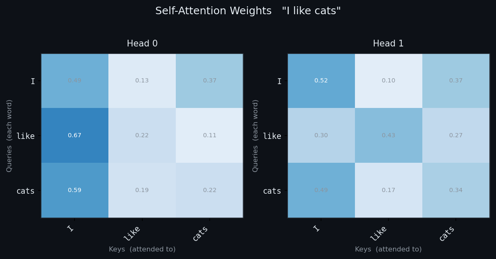
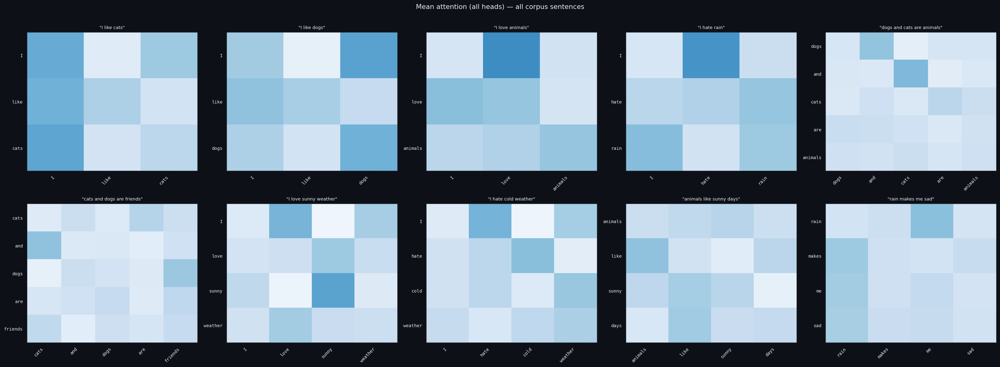
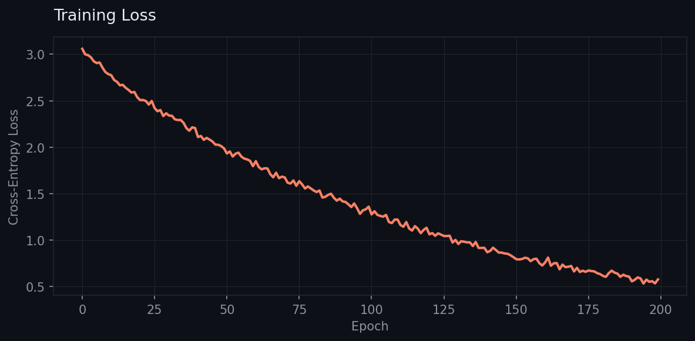
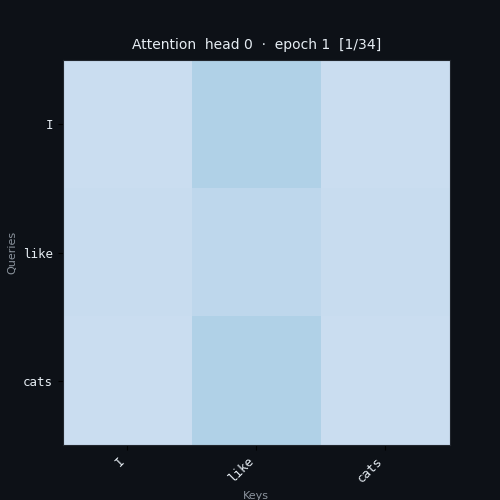

# mini-self-attention

> A minimal multi-head self-attention implementation built from scratch.
> Step 2 of the mini-LLM series.


---

## Series

| Step | Repository | What it builds |
|------|-----------|----------------|
| 1 | [mini-embedding](https://github.com/JeffreyRed/mini-embedding) | Word vectors from scratch — Skip-gram Word2Vec |
| **2** | **mini-self-attention** ← you are here | Multi-head self-attention encoder block |
| 3 | [mini-transformer](https://github.com/JeffreyRed/mini-transformer) | Positional encoding + stacked encoder layers |
| 4 | [mini-gpt](https://github.com/JeffreyRed/mini-gpt) | Causal decoder + next-token language model |
| 5 | [mini-chat] (https://github.com/JeffreyRed/mini-chat) | Full LM on real text — overfitting, generation, evaluation |
| 6 | [mini-cross-attention](https://github.com/JeffreyRed/mini-cross-attention) | Cross-attention module, source↔target alignment |
| 7 | [mini-translator](https://github.com/JeffreyRed/mini-translator) | English→Spanish encoder-decoder with cross-attention |

> **Prerequisite:** run `mini-embedding` first and keep `outputs/embeddings.pt`.
> This project optionally warm-starts from those learned word vectors.

---

## What this teaches

`mini-embedding` gave every word a fixed vector. `"bank"` always maps to the same numbers, regardless of whether the sentence is *"river bank"* or *"bank account"*.

**Self-attention fixes this.** Each word is allowed to look at every other word in the sentence and blend their information into its own representation:

```
"I like cats"

After attention, the vector for "like" is no longer fixed —
it has borrowed context from "I" and "cats".
How much it borrowed from each is the attention weight.
```

The attention weight matrix makes this fully visible:

```
         I      like   cats
  I    [0.60,  0.25,  0.15]   ← "I" attended 60% to itself
  like [0.20,  0.45,  0.35]   ← "like" split attention across all words
  cats [0.10,  0.30,  0.60]   ← "cats" attended mostly to itself
```

---

## Core concept — scaled dot-product attention

For a sequence of vectors `X` (shape `seq_len × emb_dim`):

```
Three learned projections:
    Q = X @ W_Q     queries  — "what am I looking for?"
    K = X @ W_K     keys     — "what do I contain?"
    V = X @ W_V     values   — "what do I send if selected?"

Attention scores:
    scores  = Q @ K^T / sqrt(d_k)       shape: (seq_len, seq_len)
    weights = softmax(scores, dim=-1)   each row sums to 1

Output:
    out = weights @ V                   shape: (seq_len, d_v)
```

The division by `sqrt(d_k)` prevents dot products from growing so large that softmax saturates and gradients vanish — this is the "scaled" part.

**Multi-head attention** runs `h` independent attention operations in parallel, each with its own `W_Q / W_K / W_V`, then concatenates and projects the results. Each head can specialise in a different type of relationship (syntactic, semantic, positional).

---

## Architecture

```
word indices  (batch, seq_len)
      │
      ▼
┌─────────────────────────────────────────────────┐
│  EmbeddingLayer  (vocab_size → emb_dim)         │  fixed vectors from mini-embedding
└─────────────────────────────────────────────────┘
      │  (batch, seq_len, emb_dim)
      ▼
┌─────────────────────────────────────────────────┐
│  MultiHeadAttention                             │
│    W_Q, W_K, W_V  ×  n_heads                   │  context-aware blending
│    scaled dot-product attention                 │
│    W_O  (output projection)                     │
└─────────────────────────────────────────────────┘
      │  + residual connection
      ▼
┌─────────────────────────────────────────────────┐
│  LayerNorm                                      │
└─────────────────────────────────────────────────┘
      │
      ▼
┌─────────────────────────────────────────────────┐
│  FeedForward  (Linear → ReLU → Linear)          │
└─────────────────────────────────────────────────┘
      │  + residual connection
      ▼
┌─────────────────────────────────────────────────┐
│  LayerNorm                                      │
└─────────────────────────────────────────────────┘
      │  (batch, seq_len, emb_dim)
      ▼
┌─────────────────────────────────────────────────┐
│  Linear head  (emb_dim → vocab_size)            │  next-token logits
└─────────────────────────────────────────────────┘
```

This is one transformer encoder block. `mini-transformer` will stack N of these and add positional encoding.

---

## Project structure

```
mini-self-attention/
│
├── data/
│   └── corpus.txt              # same corpus as mini-embedding
│
├── src/
│   ├── tokenizer.py            # vocabulary builder and sentence encoder
│   ├── embedding.py            # embedding layer (optionally loads mini-embedding weights)
│   ├── attention.py            # scaled dot-product + multi-head attention
│   ├── model.py                # full encoder block (attention + FF + norms)
│   ├── dataset.py              # SequenceDataset for next-token prediction
│   ├── train.py                # training loop
│   ├── utils.py                # attention weight inspection helpers
│   └── visualize.py            # heatmaps, animations, loss curve
│
├── outputs/                    # saved model + plots
├── main.py                     # end-to-end entry point
├── environment.yml
├── requirements.txt
├── THEORY.md                   # full theory + code walkthrough
└── README.md
```

---

## Quickstart

```bash
# 1. Clone and set up environment
git clone https://github.com/your-username/mini-self-attention.git
cd mini-self-attention
conda env create -f environment.yml
conda activate mini-self-attention

# 2. (Optional) copy embeddings from mini-embedding
cp ../mini-embedding/outputs/embeddings.pt ../mini-embedding/outputs/embeddings.pt

# 3. Run
python main.py
```

---

## Configuration

All hyperparameters are at the top of `main.py`:

| Parameter | Default | Description |
|---|---|---|
| `EMB_DIM` | `8` | Embedding dimension — must match mini-embedding if loading pretrained weights |
| `N_HEADS` | `2` | Number of attention heads (`EMB_DIM` must be divisible by this) |
| `FF_DIM` | `32` | FeedForward inner dimension (typically 4 × `EMB_DIM`) |
| `EPOCHS` | `200` | Training epochs |
| `LR` | `1e-3` | Adam learning rate |
| `PRETRAINED_EMB` | `../mini-embedding/outputs/embeddings.pt` | Set to `None` to use random init |
| `INSPECT_SENTENCE` | `"I like cats"` | Sentence to show detailed attention weights for |

---

## Outputs

After running `main.py`, the `outputs/` folder will contain:

| File | Description |
|---|---|
| `attention_model.pt` | Saved model weights |
| `attention_heatmap.png` | Per-head attention weights for `INSPECT_SENTENCE` |
| `all_sentences_attention.png` | Mean attention map for every sentence in the corpus |
| `loss_curve.png` | Training loss over epochs |
| `attention_animation.gif` | How head 0's attention pattern evolved during training |






---

## Deep dive — theory & code walkthrough

[`THEORY.md`](./THEORY.md) covers:

- Why fixed embeddings fail for polysemous words
- The full math of scaled dot-product attention (Q, K, V)
- Why we scale by `sqrt(d_k)`
- What multi-head attention adds over single-head
- Residual connections and why they matter
- Line-by-line walkthrough of every source file
- How this block slots directly into the mini-transformer architecture

---

## References

- Vaswani et al. (2017) — [Attention Is All You Need](https://arxiv.org/abs/1706.03762)
- Bahdanau et al. (2015) — [Neural Machine Translation by Jointly Learning to Align and Translate](https://arxiv.org/abs/1409.0473)
- The Illustrated Transformer — [jalammar.github.io](https://jalammar.github.io/illustrated-transformer/)

---

## License

MIT
